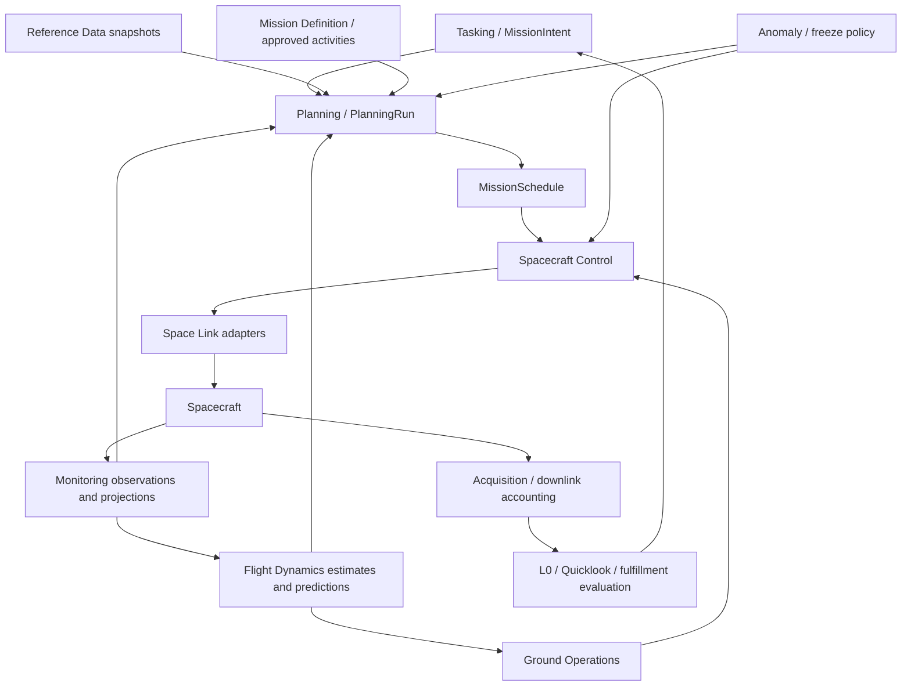

# Context map

Arrows are logical information/operation flows, not unrestricted Java imports.
No physical spacecraft connection exists in v0.1.

| Context | Ownership and published boundary | v0.1 representation |
| --- | --- | --- |
| tasking | Intent, resolved AOI reference, request revision/lifecycle, fulfillment criteria and preference | MissionIntent, ObservationRequest; no schedule object/state |
| planning | Runs, pinned input set, opportunities/results, proposals and atomic schedule consistency | PlanningRun, PlanCandidate, MissionSchedule, Assignment and resource evidence contracts |
| flight-dynamics | Orbit/attitude/propellant observations, estimates, predictions and designations | Immutable orbit/propellant subset and numerical port |
| spacecraft-control | Approved load preparation/release, transmission and execution verification, onboard shadow | Semantic load/command/evidence models; release/compiler deferred |
| monitoring | Observations and derived operational beliefs/freshness | TelemetryObservation; application projection contract |
| anomaly | Anomaly lifecycle, safety freeze, contingency procedure references | Anomaly, MissionPhase, PlanningFreezePolicy; no recovery |
| ground-operations | Station booking, pass session and report | Separate immutable contracts plus GroundStationPort |
| acquisition | Acquisition links, execution belief, data accounting/completeness | Acquisition with typed references only |
| product-generation | Lossless L0, production jobs, quicklooks and fulfillment evidence | L0Product manifest; job/quicklook behavior documented |
| mission-definition | Approved activity and command semantics, capabilities, modes, limits and verification rules | ActivityDefinition, AuthorityPolicy; database/catalog adapters deferred |
| reference-data | Automatic collection, validation, normalized versioned snapshots | SnapshotRef, ReferenceDataSnapshot, exact-reference repository port |
| space-link | Protocol encoding, transfer and link adapters | SpacecraftLinkPort contract; no concrete CCSDS package until needed |

ContactOpportunity is computed by Flight Dynamics and published as a ground
operations contract. StationBooking belongs to ground resource management;
PassSession/PassReport belong to pass execution. They must not collapse into a
single GroundContact aggregate. Real-time TT&C and high-rate payload reception
must follow separate pipelines even if a physical link is shared.

Mission Definition will version telemetry parameters, conversions, limits,
command definitions/ranges/preconditions/verification rules, activity parameters,
pre/postconditions/resource profiles, instrument capabilities, modes and
operational constraints. Protocol bindings remain infrastructure-owned; neither
tasking nor planning consumes APIDs or packet layouts.

Reference data is collected automatically via provider adapter → collector →
validation → normalization → immutable snapshot store. Users do not fetch weather,
leap seconds, EOP, space weather, DEM or geographic data manually. The foundation
uses snapshot references supplied by fixtures; there is no live collector.
