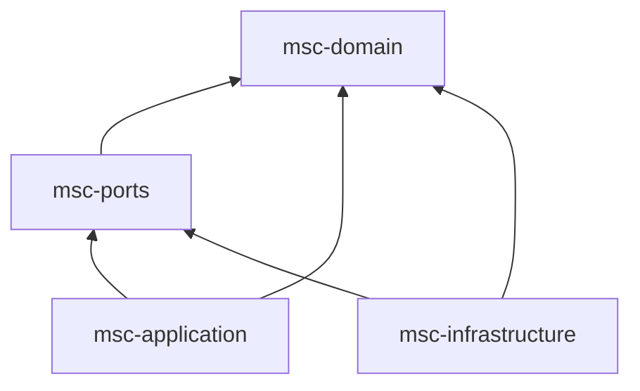

# MSC Architecture Foundation v0.1

MSC is an intent-driven autonomous Earth Observation mission operations system:
"I want to image Daejeon" is the input; MSC will eventually decide how. Users do
not need spacecraft, sensor, ground-station, time-system or command knowledge.
Automation is the interaction default; authority and physical safety are separate.

## Current architecture direction

The user now requires independently deployable MSA services for selective Kubernetes
scale-out. [ADR-0010](adr/0010-independent-services.md) records that direction. The
implementation described below is the existing foundation, not a completed MSA
backend; service extraction and distributed integration are ongoing.

## Implemented foundation structure

Java 21 / Maven / JUnit 5. Package root: `msc`; domain contexts: `msc.domain.*`.
These are logical boundaries in a modular monolith, not independently deployed services.

Arrows mean **compile-time dependency**, not control flow. Ports depend on domain
contracts; application orchestrates domain and ports; infrastructure implements
ports. This resolves the prompt's schematic arrows without introducing a cycle.
The application module depends on infrastructure only in **test scope**, to wire
the deterministic proof. No empty bootstrap module or deployable is introduced.
A future composition root may depend on application and infrastructure.

| Module | Owns | Must not own |
| --- | --- | --- |
| msc-domain | Immutable domain models, invariants, published IDs/value contracts | Wall-clock reads, protocols, persistence, web or orchestration |
| msc-ports | Clock, schedule publication, reference data, link/station/storage/numerical boundaries | Provider implementations or framework types |
| msc-application | `PlanObservation` fixture use case, monitoring projection contracts | Network clients, command encoding, physical algorithms |
| msc-infrastructure | VirtualClock and atomic in-memory schedule history | Business authority decisions or domain policies |

`Ids` contains published typed identity records, not aggregates. Cross-context
references primarily use these IDs and immutable contracts. `ScheduleKey` is a
published planning value contract consumed by commanding; it is not the schedule
aggregate. Adding a shared contract does not permit sharing aggregate internals.

## What actually runs

`./mvnw test` runs the deterministic Daejeon proof and invariant/dependency tests.
`./mvnw verify` additionally packages the four library modules. A test is the
composition root; there is no server, CLI deployment, optimizer or command release.

The fixture use case resolves an exact target to `DaejeonAOI`, accepts a request,
pins ten input references, constructs one approved-activity proposal and commits
one assignment with compare-and-set version publication. Repeating with a new
run/candidate/activity/assignment ID appends a new immutable schedule version.
The same request ID can be used across those planning runs. Request persistence
and deduplication are not implemented. These are explicitly supplied fixtures,
not geocoding, orbit/weather validation or a production planning decision.

Reservoir validation remains `NOT_EVALUATED`; external bookings are not made.
A successful fixture commit is not permission to release commands.

## Enforcement and checks

Maven's compile classpaths keep domain free of production dependencies and keep
infrastructure out of application production code. ArchUnit 1.3.0 is test-only in
application: it examines **compiled production bytecode** from all four modules.
It enforces allowed domain dependencies, tasking/planning separation, no planning
transport/control dependency, inward application/port dependencies, and selected
wall-clock API bans. It handles fully qualified type references as well as imports.
There is no architecture library in production. JUnit 5 tests check real behavior,
including exclusive conflicts, history, atomic concurrent commits and fake time.

The checks do not prove reflection-based dynamic loading safe, distributed
consistency, mission physics, command authorization, or eventual simulator fidelity.
Review remains necessary when extending the allowed JDK surface or context contracts.

## Future deployment capacity

No Kubernetes manifests/topology or numeric resource values are selected. Before
introducing a deployable, measure CPU requests/limits, memory requests/limits,
storage IO, network throughput, concurrency, workload type, latency sensitivity,
and scaling behavior. JVM capacity must separately account for heap, metaspace,
direct/native memory, thread stacks and JVM/runtime overhead. Payload pipelines
have different throughput/IO characteristics from synchronous command gates.

## Navigation

- [Context map](context-map.md)
- [Domain model](domain-model.md)
- [Time model](time-model.md)
- [Event model](event-model.md)
- [Simulation](simulation.md)
- [Glossary](glossary.md)
- [Repository assessment](repository-assessment.md)
- [Open decisions](open-decisions.md)
- [Accepted decisions](adr/README.md)
