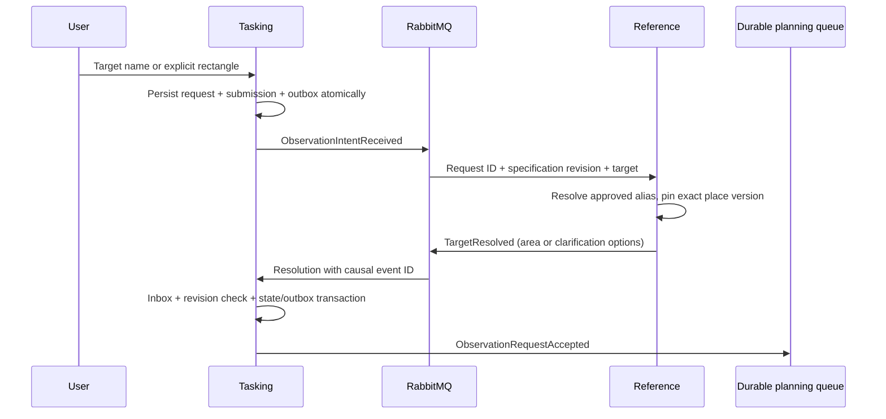

# Tasking and approved geographic reference services

Status: Implemented and exercised as independent JVM processes with separate
PostgreSQL databases and RabbitMQ queues. This is the request intake segment;
planning, command execution and product generation are not implemented by it.

## Operating flow

Explicit coordinates can be accepted immediately. Unresolved names retain an empty
AOI; unknown or ambiguous names become `CLARIFICATION_NEEDED`. Matching is Unicode
NFKC, whitespace-normalized and case-insensitive. Homonyms are never resolved by
arbitrary first-row selection. The normal caller does not select a spacecraft,
sensor, orbit or ground station.

Reference-data currently owns a versioned, ADMIN-approved geographic catalog.
It is not yet a global geocoder, automatic external gazetteer collector, weather
collector, or the Orekit reference archive lifecycle service. These remain part
of the full backend goal. Its registered coordinates are explicitly sourced;
the verification scripts register synthetic fixtures, not qualified operational
geography. Existing accepted requests retain their chosen area when the catalog
advances to a newer version.

## Revision, ownership and provenance

The outer stored `version` is the expected version for PUT/cancel. The inner
`request.revision` fences planning and external outcomes: edits, cancellation and
expiry invalidate earlier work. Scheduling/partial fulfillment change persistence
version without changing the accepted specification revision. Stale events cannot
restore a cancelled, expired or superseded request.

Create, revise and cancel use actor-scoped idempotency keys. Request reads and
mutations enforce ownership; ADMIN/OPERATOR have explicit operational access.
Client-supplied `owner` fields are rejected. List queries enforce the same ownership
filter and support an ID cursor with up to 100 results per page. Internal endpoints
require SERVICE authorization.

Canonical submitted fields are stored independently from effective request fields.
Caller-supplied coordinate IDs and source claims do not become approved catalog
identities: explicit rectangles receive a request/revision/content-bound ID and
reference their preserved submission. Selecting an exact previously offered
clarification option retains that verified catalog version. The source endpoint
returns submitted field values, not byte-for-byte HTTP formatting.

Without explicit criteria, the effective default is complete requested-area
coverage and no cloud restriction (`minimumCoverageFraction=1`,
`maximumCloudFraction=1`). The effective criteria are returned separately from the
submission. AUTO is a default interaction preference and grants no command authority.

## API

All mutations require `Idempotency-Key` and authentication.

| Method | Endpoint | Meaning |
| --- | --- | --- |
| POST | `/api/requests` | Submit `target`, optional `area`, `criteria`, TAI `deadline`, `priority` 0..100, and preference |
| GET | `/api/requests/{id}` | Owned request, outer persistence version and inner specification revision |
| GET | `/api/requests?limit=100&after=...` | Owned cursor page |
| PUT | `/api/requests/{id}` | `{expectedVersion, submission}` creates a new specification revision |
| POST | `/api/requests/{id}/cancel` | `{expectedVersion}` invalidates future tasking |
| GET | `/api/requests/{id}/submissions/{revision}` | Owned preserved submitted fields |
| GET | `/internal/requests/{id}` | Authoritative request details for service workflows |
| GET | `/internal/requests/{id}/submissions/{revision}` | Exact source fields for a service audit |
| POST | `/api/places` | ADMIN registers the next approved place version and aliases |
| GET | `/api/places?target=...` | Approved alias matches, including ambiguity |
| GET | `/api/places/{id}/versions/{version}` | Exact immutable place version |

Place area IDs must be `placeId:version`; all rectangles use WGS84 longitude/latitude
bounds and cannot cross the antimeridian. Planning must still prove actual AOI
coverage; a point-access opportunity is not full rectangle coverage.

Cancellation acknowledges future tasking invalidation. It does not assert that
already uplinked commands stopped; future control integration must reconcile those
separately. A deadline worker uses the mission Clock and per-request PostgreSQL
locks, checks the state again under lock and emits invalidation transactionally.

`ProductQualityAssessed` carries request revision, product/acquisition/assessment
references and coverage/cloud measurements. Tasking checks its effective criteria
before transitioning to partial/full fulfillment. The live verifier injects synthetic
quality events solely to test this consumer; there is no implemented product
pipeline or actual fulfillment evidence yet. `PlanningRejected` records evidence
without turning temporary infeasibility into a permanent rejection.

## Verification

The full default suite passes 46 tests, including four new request-domain tests.
`scripts/verify-tasking.py` exercises actual HTTP, both service-owned databases,
outbox/inbox and RabbitMQ: resolution, ambiguity, pinned catalog history,
owner isolation, pagination, revisions, stale resolution/schedule rejection,
cancellation, expiry and synthetic quality thresholds. A duplicate event followed
by a queue barrier verifies no duplicate local state effect. The ADMIN-only
`/api/admin/delivery/inbox/{eventId}` reports transaction completion without exposing
payloads or credentials.

`scripts/verify-tasking-replicas.py` runs against two tasking JVMs on 8101/18101 with
the same owned database and queue. Cross-process repeated creation yields one
request; concurrent revisions yield one success and one HTTP 409. Cancelled work
is not revived by a delayed schedule, and competing expiry workers produce one
durable transition. This is local process scaling evidence, not Kubernetes/HPA
verification. Restart checks preserve existing request and exact gazetteer versions.
